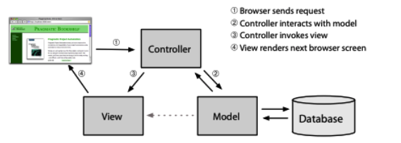
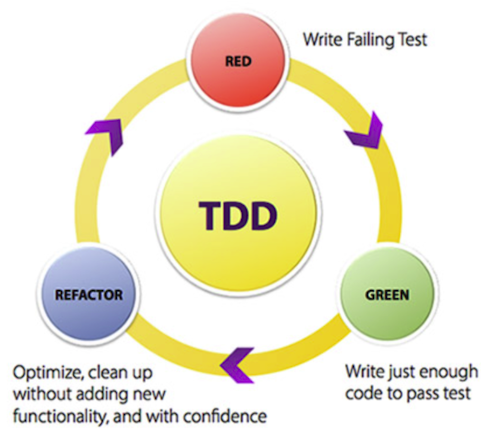
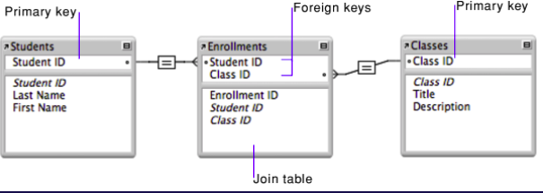
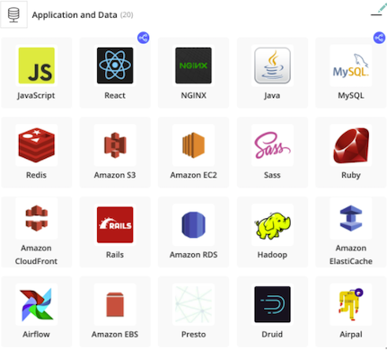
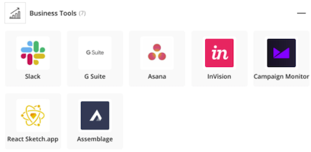
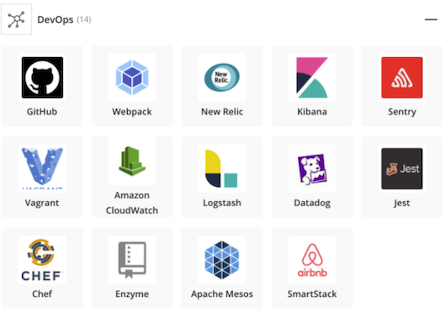
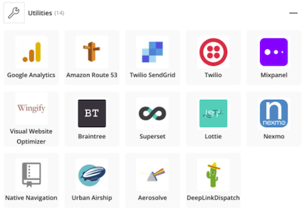
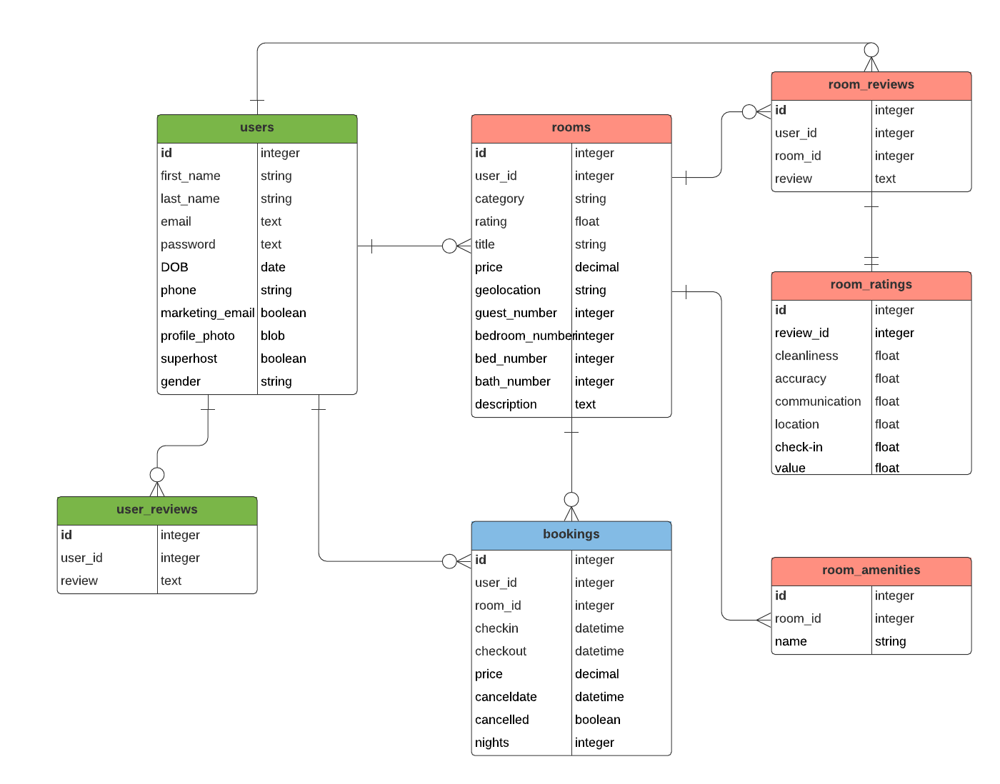

# T2A2 Workbook

# Q1: **Describe** the architecture of a typical *Rails* application:

A typical Rails application follows an architectural pattern known as 'Model, View, Controller', commonly referred to as "MVC". Each one of these parts serves a very specific function, thus creating modularity within a Rails application.

 - The **model** is a representation of all of the data within a Rails application. Its role is to maintain 'state', which can either be *transient* (i.e. lasting temporarily, perhaps lasting for only a few interactions between it and the user), or it can be *permanent* (stored externally, typically in a database). Moreover, beyond the storage of transient and permanent data, the model is also able to enforce constraints on said data. For example, if the user is not entitled to free shipping if their order is under a certain amount, the model is in charge of designating that constraint (Heinemeier Hansson 2016; Sravan Cynixit 2020).

- The **view** acts as the generator of an interface for the user. Typically, this view will be dependent on data within the aforementioned model. For example, one view might display the list of products available / for sale on an online store. Another might handle the user's ability to add or edit their cart (Sravan Cynixit 2020).

- Finally, **controllers** can be likened to the 'brains' of the application. As the middle-man of the app, the controller orchestrates all facets of functionality--from receiving information (usually from a user) to interacting with the model to then relaying that information to the views to be displayed/updated (i.e. on a browser) (Sravan Cynixit 2020).

The below image exemplifies this relationship:


Specifically, in a Rails app, a request is first sent to and received by a router. Then, the router directs this request to a specific point in the app along with instructions on how to parse it (via an action in the controller). This action will then do whatever is stipulated in its code (be it interacting with the model, looking at data, initiating other actions, and so on) and eventually prepares information in such a way for the view to then render to be visible to the user (RailsBridge 2021).

There are a number of pillars (9, to be exact), laid out within the Rails Doctrine upon which Rails was designed. Perhaps the most important of these is "Convention over Configuration" (aka "Coding by convention), which significantly limits the decisions a developer must make by creating a 'default' set of conventions and structures that a developer can choose to follow (Heinemeier Hansson 2016; BigBinary, 2021). This process frees a developer from spending ample time deliberating, making decisions and doing manual configuration. As you build the app, these configuration defaults are able to intelligently tie in all MVC components, so the developer doesn't need to write a great deal of external configuration metadata to make the app functional. One such example of the aforementioned conventions is a class 'Books' mapping to a 'books' table in the database by default.

# Q2: **Identify** a database management system (DBMS) commonly used in web applications (including Rails) and discuss the pros and cons of this database

PostgreSQL is an entirely open-source, production-ready object-relational database management system that is used by developers and system administrators all over the world. Development began at the University of California (Berkeley) in 1986 during the POSTGRES project. The platform has impressively accumulated more than 30 years of active development. It's incredibly popular, reliable and a lot of new startups use PostgreSQL over other options for a number of reasons. However, there are also a variety of downsides and so it is important to weigh up the pros and cons for decision-makers to make an informed decision (PostgreSQL, 2021).

## **Advantages**
- Entirely free and open-source, no license required. Businesses can use, modify and utilise it in a way that suits the business scope and requirements
- Actively improved, updated and developed, with a history of more than 30 years of active development
- Hugely popular, most data science tools are highly compatible and work well with it
- It supports common table expressions, so as to make big queries more readily understood ("WITH")
- It is capable of handling unstructured data
- Broad language support (Ruby, Java, PHP, Python, etc)
- Can be used for location-based services as it supports geographic objects
- Supports many modern app features, including but not limited to JSON, XML, Table Partioning, Point in Time Recovery, etc.
(Amit Phaujdar 2021; Derivaux 2019; Ediger 2021)

## **Disadvantages**
- Has a reputation for being slow in certain performance areas, which needs to be manually optimised by the user
- No single company/entity owns PostgreSQL, which means there is no 'centralised' support system in place to debug and provide solutions to problems (rather, there are consulting companies that specialise in PostgreSQL support)
- When a new version is released, existing data must be either replicated or exported
- Lack of centralised support demands a higher learning curve
- Medium to large-sized businesses can face migration challenges when switching to Postgres which requires collaboration with third-party support vendors/migration services
(Amit Phaujdar 2021; Derivaux 2019; Ediger 2021)


# Q3: **Discuss** the implementation of Agile project management methodology

Agile is a dynamic and adaptive philosophy to project management. The Agile approach emphasises the following four principles:
- *"Valuing individuals and interactions over processes and tools"*
- *"Developing working software versus documentation"*
- *"Collaborating with customers versus contract negotiation"*
- *"Quickly responding to change versus following a plan"*

(MacKay 2018)

By following these principles, teams are able to handle complexities in software development projects by reacting and adapting to regular client/user feedback, market/industry trends and other problems or concerns as they arise. Ideally, this results in a more efficient and suitable product, faster/more regular products & updates, a happier client and cohesive team collaboration.

Specifically, this approach focuses on releasing solutions (product/updates) often, moving quickly, developing user stories, having open feedback loops with clients/users/teammates, regularly meeting internally/externally (e.g. stand-ups, retrospective, pre-planning, feedback), maintaining Agile boards to track progress (e.g. sticky notes, kanban boards, etc) and breaking down a project into 'sprints'.

Each sprint will have its own requirements, deadlines, frameworks and priority levels. Teams will iterate on and release 'sections' of a final product (i.e. updates, versions, etc), rather than spending a great deal of time pre-planning (like in the Waterfall method), thereby making it a much more adaptive and responsive approach to software development.

One potential example of a project management cycle using the Agile approach is as follows:

> ### **Goals definition / project scope**

This is the first meeting that will ideally involve important stakeholders, team members and any other key parties to get as many ideas and feedback as possible. The goal of the meeting will be to specifically identify a business need that the project is solving for, i.e.:

- *What is our end goal?*
- *How do we achieve our end goal?*

> ### **Product Road Map (high-level)**

After identifying a clear goal for the project, the product road map stage, as conducted by the product owner, will focus on creating rough time/resource estimates as to workload, so that stage-by-stage goals can be defined, delegated and prioritised. Essentially, this is a high-level map to the final vision of the project's Minimum Viable Product ('MVP').

> ### **Release plan (high-level)**

As there are normally multiple versions/releases in an agile project, the product owner must be in charge of defining which features/versions need to be prioritized and launched first. This stage focuses on crafting high-level timetables for each release.

> ### **Sprint plan (micro-level)**

Carried out by the product team (with input from the product owner and others), each sprint is specifically planned out (tasks, backlog items, delegation, timeframes).

> ### **Regular check-ins (e.g. stand-ups)**

- Daily stand-ups are extremely common and needed so as to erradicate roadblocks before they become a larger problems. Generally standups last no longer than 10-15 minutes and cover things like:

- *What did you work on yesterday?*
- *What are you focusing on today?*
- *Any roadblocks?*

> ### **Sprint review & sprint retrospective**

Once the release/update/product has been shipped post-sprint, it is important for the team to connect and fully flesh out what was done and how (to both your team and to stakeholders). This is a great chance to address anything that went wrong, what can be improved, what was learned and what aspects of the plan were/were not met. All those learnings and improvements are discussed and the plan for the next sprint is adapted so it can run more and more smoothly each time.

(MacKay 2018; Wrike 2021)

# Q4: Provide an overview and description of a standard source control workflow 

Source control (or version control) tracks and manage changes of a software project's source code. This workflow aims to mitigate the risk that arises when multiple people (i.e. a team) work collectively on one codebase, by ensuring there is always a 'single source of truth' and facilitates resolution of any code conflicts. One example of such a workflow is Git. Git is an entirely open source source control system, which is hugely popular amongst the software development community. There are many workflows within Git itself, including but not limited to Centralized, Forking and Gitflow. To get a better understanding, let's delve into exactly what a centralized workflow looks like in practice:

<div style="page-break-after: always;"></div>


> ### **New repository**

- Create a central repository (either existing Git or new repository) with `git init`

> ### **Clone**

- Each developer will create their own clone of the repository on their own device (i.e. locally) using `git clone`

> ### **Editing/staging/committing**

- Each developer can then edit, stage (`git add`) and commit (`git commit`) as many times as needed without having to worry about what is going on in the centralised repository, as these commands only take effect on the local repository.

```ruby
git add <file_name> # this will stage a file

git status # this will view the current state of the repository

git commit # this will commit the staged files and allow the user to type a detailed commit message```
```

> ### **Pushing changes back to the central repository**

- When commits are ready to be pushed, (via `git push origin <branch-name>`) there is always a chance that updates have already been pushed by another member of the team to the central repo.

> ### **Pulling changes to local repo**

- In the case of the above, when trying to run a `git push` the terminal will display a message to the developer know. At this point, a `git pull` can be used to then attempt to pull the most current version of the code to the local repo and integrate them with local changes.

> ### **Conflicts**

- However, if the local changes eventuate in conflict with any commits that are upstream, Git will simply not push the changes (as the central repository's commit history is the source of truth for a project). To overcome that, the developer be required to fetch the updated commits from the centralized repo and then opt to rebase their changes over the top of them (i.e. essentially, push them to the front). If this still results in a conflict, the user can manually resolve conflicts. This is why it is important to commit often and with meaningful commit messages. 

(Atlassian 2021)

<div style="page-break-after: always;"></div>

# Q5: Provide an overview and description of a standard software testing process (e.g. manual testing)

Quite like source control workflows, there are also a plethora of options when it comes to software testing processes. One such testing methodology is known as Test Driven Development (aka TDD). The three laws of TDD are as follows:

- "You are not allowed to write any production code unless it is to make a failing unit test pass."
- "You are not allowed to write any more of a unit test than is sufficient to fail; and compilation failures are failures."
- "You are not allowed to write any more production code than is sufficient to pass the one failing unit test."

(Trevino Saldana 2021)

Essentially, we can simplify this and say-- produce *only* enough of a unit test for it to fail, and only enough code to make the said test pass. TDD is very much a 'test-first' approach, whereby a particular function/feature of the program is designed and its functionality is rigorously tested via a unit test. Given this test-first approach, this test is designed to initially fail. The next step is do produce code that will pass the unit test (ensuring it is *only enough* to pass). The code can then be 'refactored' as needed and these steps are subsequently repeated (Trevino Saldana 2021).

This specific process can be best exemplified here:



Though unit testing is more labour and time-intensive at the initial build stages, it ensures that code is fully functional, easily reviewed and iterated upon, robust and performs well under scrutiny. Specifically, in Rails, TDD can be easily utilised to test the integrity and functionality of specific areas of code through the use of gems (such as Rspec).

# Q6: Discuss and analyse requirements related to information system security and how they relate to the project

In order to ensure ACME is doing its due diligence when it comes to information system security, it is important to apply the CIA triad of information system security (aka INFOSEC) process. CIA, in this instance, stands for Confidentiality, Integrity, and Availability.

### **Confidentiality**
- This element of the triad pertains to ensuring that *only* the right person has the right access to the right data through a process of authorization. Confidentiality can only be assured when any unauthorized attempts to access data are blocked. This would include ACME ensuring they employ rigorous techniques such as requiring complex passwords, encryption, authentication as well as employing other defence methods against potential unwarranted attacks (Fruhlinger 2020).

### **Integrity**
- Integrity refers to the process of maintaining data in the state it is intended, and stopping it from being modified (either on purpose or by accident). The techniques mentioned above will also serve well here (i.e. passwords, encryption, etc) given that a malicious attacker cannot manipulate data they can't access, but there is an additional level of defence that can be employed here by ACME to ensure they are doing their due diligence in terms of data integrity. Frequent and automated/manual backups provide an additional layer of protection for ACME, in the event of critical failure and loss of information. Additionally, version control (like Git) will be particularly helpful for this project, from two standpoints: protecting code against 1) malicious, intentional attacks and 2) unintentional developer mistakes (Fruhlinger 2020).

### **Availability**
- Finally, availability pertains specifically to the right person having the access to the data they should. To ensure this, ACME's computing and network resources must adequately account for the volume of data access that is anticipated by the project at any given time, as well as having significant backup policies in worst-case scenario data recovery circumstances (Fruhlinger 2020).

### **Security Policy**
- When it comes to applying the above three principles, ACME must ensure they have a well documented and detailed security policy in place that is communicated and distributed to their entire team. Ideally, this documentation should bear in mind the three principles discussed above, and flesh out priorities and particular areas of concern. The policy document should establish explicit guidelines around things like employee behaviour and responsibilities, decisions around cybersecurity software and tools, password policies, access control policy, data support and operations, ensuring to also include any other parties (external) that may be involved within the information cycle of the project (Fruhlinger 2020).

# Q7: Discuss common methods of protecting information and data and how you would apply them to the project

#### Risk assessment
- With respect to protecting information and data, ACME will first need to complete a risk assessment to understand the current state of security protocols that are in place already. That way, ACME can get a full picture as to what is working, what isn't and how and why the latter is occurring. From this assessment, the company can understand in what way their data is currently vulnerable, and can they weigh the severity of data breach risk against the probability. Once done, they should consider the following data protection methods.

#### Backups
- As discussed in Q6, backups are essential to prevent data loss in the case of user error, technical malfunction or malicious attack. Within ACME's project, they should ensure these backups are encrypted, checked regularly for deterioration, stored in a safe/secure place and prioritised in terms of importance (i.e. more important data backed up more frequently). Moreover, if ACME uses a cloud service to store backups, they must make sure that no sensitive information is stored in them.

#### Access controls
- ACME can significantly reduce its risk by employing access controls across the board in the form of a clear and concise data protection policy. A major part of this would be in ACME being confident in that they are limiting access to sensitive data to only those employees that specifically require it and can be trusted (and reviewing this access often). The company should also ensure they are maintaining regular and up-to-date data handling educational programs for all employees (new and old) throughout all stages of designing, building and rolling out the marketplace app.

#### Destruction
- ACME would need to have proper protocols in place to ensure the destruction of data that can and should be removed, in a matter that is final. This will prevent unauthorised recovery and access of potentially sensitive data and associated attacks and breaches, thus increasing customer confidence.

#### Pseudonymization
- Given ACME will likely be handling significant sensitive user information in the development and operation of their marketplace app, another recommended data protection method is that of pseudonymization. Simply put, this process removes unique identifying factors from bits of data. That way, there is no associative link between these portions of data, it adds a layer of complexity for potential hackers, and thus enhances security for ACME.

#### Encryption
- Finally, encryption is essential. The process of encryption transforms data into somewhat meaningless and non-sensical strings so that only with an encryption key is it readable. This allows for safer communication and the transfer of data. It also means ACME can have greater confidence that data has not been tampered with while travelling through the network.

(GDPR Informer 2017)

# Q8: Research what your legal obligations are in relation to handling user data and how they can be met for the project

For the purposes of discussing ACME's specific legal obligations with relation to handling user data in this question, only Australian legislation will be examined. However, it is worth noting that if ACME has overseas operations that these location's security and privacy regulations must be taken into account.

The [Australian Privacy Act of 1988](https://www.legislation.gov.au/Details/C2021C00452) explicitly states 13 privacy principles. ('APP'), all of which ACME must strictly adhere to. These principles specify in no uncertain terms how to deal with personal information and what it is, the method in which it can be collected, who can access it and how it can be corrected, and finally, its integrity. Consequences of failing to follow these can result in penalties and other regulatory actions. Such consequences may even include cessation of the development of the app altogether.

At all stages through the design, build and roll-out of the marketplace app, ACME must ensure they maintain an APP privacy policy that abides by regulations set out in the Privacy Act. It must be made freely accessible on the ACME website for all to access. Some examples of ACME's legal obligations include the following:

- Give an option to individuals who wish to identify with a pseudonym, for anonymity purposes when gathering data within the app.
- When collecting personal information, ACME must make sure consent is gained, only necessary/required information is asked for (that directly relates to the functionality of the marketplace app), and that they collect it through lawful means
- Be open and transparent in communication with their users about the collection and user of their personal information.

(Australian Privacy Act, 2021)

<div style="page-break-after: always;"></div>

# Q9: Describe the structural aspects of the relational database model. Your description should include information about the structure in which data is stored and how relations are represented in that structure.

A relational database is a type of database that aims to both store and provide access to various related data points. Examples of relational databases are PostgreSQL, MySQL, Oracle Database Cloud, amongst many others. Based on a relational model, a relational database structure is explicit. Data is organised in tables that have a name (representing the data that is included within it), rows (tuples) and columns (OCI 2020). The latter represents the attributes/qualities of the data that is included within the table (e.g. 'Name', 'Price', 'Category'). Rows, on the other hand, represent the instance of entities within the table (e.g. 'Toy dog', '15', 'Plushies'). As you can see, these tables represent a collection of relationships. Relationships between these elements are defined by keys. Each row will have a primary key (e.g. Product ID). Foreign keys can also be designated so as to create cross-table associations between different tables of data, as seen below:



Some examples of database relationships are one-to-one, one-to-many and many to many. Given the structure discussed above, it makes the most sense to adopt a relational database structure when dealing with data that does not change often and will be consistent amongst all instances of the data (OCI 2020).

# Q10: Describe the integrity aspects of the relational database model. Your description should include information about the types of data integrity and how they can be enforced in a relational database.

Given how much data is stored, consumed and generated, it becomes more and more important to comprehend, define and preserve the integrity of data. The process of data integrity in a database refers to just that -- ensuring the data that is collected and stored is reliable, accurate and consistent. There are three predominant ways to do that within a relational database:

<div style="page-break-after: always;"></div>

### **Entity Integrity (aka key constraints)**
- Entity integrity means that each table must specify a unique (and not null) primary key.

### **Domain Integrity**
- Domain integrity refers to a set of processes that demand that all data items are associated with the correct domains. As an example, if a user types their phone number into an email address field, the program will display a relevant error message that prevents the user from completing the form based on that incorrect input. This process ensures that all data included within the database is both "recoverable and searchable".

### **Referential Integrity**
- Lastly, referential integrity pertains to a set of procedures that are enforced to ensure all data within a database is stored and used in a consistent manner, via foreign keys. These keys can exist in two different states; they can point directly to a primary key value on a separate (related) table, or they can be null. The latter would indicate there are no relationships or that the associations are in fact, unknown.

(Techopedia 2011)

# Q11: Describe the manipulative aspects of the relational database model. Your description should include information about the ways in which data is manipulated (added, removed, changed, and retrieved) in a relational database. 
Relational databases can be manipulated via data manipulation languages, such as Structured Query Language ('SQL'). The backbone of functionality within relational databases is 'CRUD', which stands for "Create", "Read", "Update" and "Delete". As an example, when using SQL, specific keywords allow us to 'query' the database by requesting data or information from the table--which gives specific instructions to the database as to how to proceed. This is explored in more depth below.

<div style="page-break-after: always;"></div>

### **Create** (`INSERT`)
When actioning a 'create' method in a Rails application (e.g. through an HTTP post request), or manually querying the database, there are a few ways to add data.

First of all, before being able to insert data into a table, a table must exist. As an example, in PostgreSQL, the following could be typed to create a basic Customers table with a few constraints:

```sql
CREATE TABLE customers(
id SERIAL PRIMARY KEY,
name VARCHAR NOT NULL,
address VARCHAR NOT NULL,
city VARCHAR NOT NULL,
phone INT,
email VARCHAR
);
```
The above will indicate that the id will auto-increment (a key function of the 'serial' type) and it will also act as the primary key. It will also constrain the name, address and city fields to be not blank, enhancing data integrity, as discussed in the previous question.

To add a row to the existing table:

```sql
INSERT INTO customers (name, address, city, phone, email)
VALUES (
'Angela', '47 Example St', 'Melbourne', '415123123', 'angela@test.com'
);
```

Or, to insert data only into required columns:
```sql
INSERT INTO customers (name, email)
VALUES ('Angela', angela2@test.com);
--This would result in null values for all other columns, OR if in creating the table it was specified that values cannot be null, it would result in an error.
```
The above queries would result in one table called Customers, complete with one row of data relating to the customer with the name of 'Angela'. The ID will automatically populate as '1' and would increment with each new entry that is added to the table.

An equivalent ruby command to insert data into the Customers table is the following:
```ruby
customer = Customer.create(name: "Patricia", address: "123 Simpson Lane", city: "Brisbane", phone: '911', email: "patricia@skynet.com")
```

### **Read** (`SELECT`)
Reading data in Rails is exemplified through the 'show' method in the controller, which is likely executed via an HTTP GET request (i.e. returning one resource). An example of the eventuating and equivalent SQL code is as follows:

```sql
SELECT * FROM customers
WHERE id=1;
```
 This would return the first customer entry, as it was automatically assigned an ID of 1 (i.e. 'Angela'). The SELECT statement grabs the data, and the WHERE statement allows us to filter it based on a specific condition.

Alternatively, via ruby, data can be read in a number of ways, some examples of which are exemplified below:
```ruby
customers = Customers.all # returns array of all customers
#####
customer = Customers.where(name:'Angela') # returns customers with name of Angela
######
customer = Customer.find(2) # returns the customer with an id of 2
#####
customer = Customer.find_by(city:"Brisbane") # returns all customers that live in Brisbane
#####
customer = customer.first # returns first customer in table
```

### **Update** (`UPDATE`)

The update method in a rails app controller is generally executed via an HTTP put/patch request. An example of this is shown below:
```sql
UPDATE customers
SET name = 'Angela Johnson'
WHERE name = 'Angela';
```
This would update the customer row where the value of Name is 'Angela', and change that value to 'Angela Johnson'.

Alternatively, in Ruby this process can be executed like so:
```ruby
customer = Customer.find_by(name:"Angela")
customer.update(name:"Angela Johnson")
```
Or, alternatively:
```ruby
customer = Customer.find_by(name:"Angela")
customer.name = "Angela Johnson"
customer.save
```

### **Delete** (`DELETE`)
Finally, the destroy method in a Rails app is the equivalent to an example such as the following in SQL:
```sql
DELETE FROM customers
WHERE name = 'Angela Johnson';
```
Or alternatively in Ruby:
```ruby
# Delete just one Customer
customer = Customer.find_by(name: "Angela Johnson")
customer.destroy

# Delete just one customer
Customer.destroy_by(city: "Brisbane")

# Destroy all customers at once
Customer.destroy_all
```
Additionally, a table can be deleted entirely via `DROP TABLE`:
```sql
DROP TABLE customers;
```
Though the above certainly only begins to scratch the surface in terms of possibilities of data manipulation within a relational database, it provides a substantive overview of what is possible.

(PostgreSQL Tutorial 2021; W3Schools 2021)

<div style="page-break-after: always;"></div>


# Q12: Conduct research into a marketplace website (*app*) and answer the following parts:

> a. **List and describe the software used by the app**

- Airbnb is a massively popular two-sided rental marketplace that utilises a vast suite of software to run, as can be seen here in Stackshare:





For the purposes of this discussion, some of the major components of Airbnb's software stack are highlighted below:

> ### **Languages** 
- Javascript
-  Ruby

> ### **Frameworks**

 - *React*: Used predominantly for front end web design, React is a well-known Javascript framework built on the Javascript language. Airbnb utilises this framework to create a sleek user interface.

 - *Ruby on Rails*: This is the primary (base) framework that Airbnb utilises. Rails is both designed in and operated in the Ruby programming language. Though Rails has capabilities of handling the front end, Airbnb opts to use Rails solely for the back end (as mentioned above), while maintaining a React front end.

<div style="page-break-after: always;"></div>

> ### **Storage**
 - *Key-value (Redis)*: Airbnb utilises Redis as a key-value database storage option. Redis is a non-relational caching database.
 - *Cloud (Amazon S3, EBS)*: Airbnb uses the likes of Amazon S3 and EBS to allow for the storage of a massive amount of user data (profile pictures, rental images, etc).

> ### **Cloud hosting** 
- *Amazon EC2*: Amazon EC2 is known to be a highly efficient tool in limiting app downtime by efficiently distributing incoming traffic to the site.

> ### **Cloud database**
 - *Amazon RDS*: Amazon RDS is a cloud relational database that is used by Airbnb for data storage. Previously they used MySQL.

> ### **Web Server** 
- *Nginx*: The web server Airbnb uses is called Nginx, which is a proxy and HTTP server that allows for quicker content delivery and provides security and scalability for the app.

> ### **Big Data**
- *Presto, Druid, Airpal*: Given how user-data heavy Airbnb is, it makes use of big data tools such as the likes of Presto, Druid and Airpal to accommodate storing, processing and analyzing such extraordinary amounts of data.

## **b. Describe the hardware used to host the app.**
Airbnb is an entirely cloud-based application. Amazon EC2 server hosting handles all physical hosting requirements. Because it is all completed via the cloud, hosting is scalable based on what Airbnb needs at any point in time (i.e. when there is higher demand, EC2 uses more servers, and vice versa). When it comes to data hosting, Airbnb opts to use Amazon S3 and RDS. Again, they allow for scalability based on need. Given this entirely cloud-based structure, Airbnb has little to worry about in terms of storing and maintaining servers. However, as can be expected, as the app scales and becomes dependent on more and more more resources, the cost of these systems also grows (Osadchiy 2011).

## **c. Describe the interaction of technologies within the app**
As mentioned previously, the base framework on which Airbnb runs is Ruby on Rails. Rails handles the entirety of the back end functionality, together with the React framework to create a dynamic and stylish front end experience and interface. The user can open up the app via the browser (or app). As discussed above, Airbnb uses Nginx web servers. So, when the user interacts with the browser, an HTTP request is sent to the server, and the server responds accordingly depending on the instruction given. If a user is searching for an image, a database query will be sent via the S3 database (cloud storage of media). For data queries it will go through RDS. Redis is responsible for caching anything that can be, temporarily, thus improving speed (e.g. if a user goes back to the same page they were already on, or there is the same data used on another page they click on). Braintree is used to handle any payment actions initiated by the user (Osadchiy 2011).

## **d. Describe the way data is structured within the app**

 Airbnb is a two-way marketplace and uses a relational database model to structure its data. This means that the data within the app is organised into tables with rows (tuples) and columns. Each of these tables can have some sort of interconnected relationship (i.e. a User table may have zero or many Bookings, and a Room Review must have a Room Rating). Within these tables, rows represent the instances of records in a specified data type (e.g. string, integer), whilst columns represent the attributes themselves (e.g. name, description, price). Moreover, a user can be a host, a guest, or both. A user can have multiple roles; they can be a guest, a host, or both. A user can have unique data points (e.g. email), and can also have other related data that pertains to that user (hosting location, favourites, etc). The marketplace itself includes accommodation and experiences that a user can either book, cancel, create or buy from other users within the app (Airbnb 2021). Again, these would hold specific and unique information (e.g. description, name) as well as being associated with other points of data in other tables (e.g. ratings, reviews, categories, etc).

 As can be expected, in a two-sided marketplace such as Airbnb, there are vast many relationships that exist between such tables. A relational database structure efficiently facilitates this retrieval of data between these related tables, and as a result, diminishes the need to write more code, therefore adhering to DRY principles).

## **e. Identify entities which must be tracked by the app**
For the sake of clarity in this project, if we simplify Airbnb to include just rental accommodation (sans alternative experiences), predominant entities that must be tracked include:

 - *Users*: This entity is dual purpose in nature, and will cover both host/guest profiles. It will include information like the first name, last name, email, password, DOB, phone number, gender, currency, location, photo, marketing email, whether the user is a 'superhost' and so on.
 - *Bookings*: check-in, check-out, whether it has been cancelled, cancel date, number of nights booked, etc.
 - *Rooms*: price, location, number of guests allowed, number of beds, baths, description, category, etc.
 - User Reviews: a description of review given by reviewer
 - *Room Reviews*: a description of a guests experience with a particular room,
 - *Room Rating*: linked to room reviews, this is a float value that is based on cleanliness, accuracy, communication, location, check-in and value as determined by the guest/reviewer.
 - *Room amenities*: a list of what amenities are associated with each room.

 <div style="page-break-after: always;"></div>

## **f. Identify the relationships and associations between the entities you have identified in part (e)**

> Users
 - Has zero or many: rooms, bookings, user reviews, room reviews
> Rooms
 - Belongs to: user
 - Has zero or many: bookings, room reviews
 - Has many: room amenities

> Bookings
 - Belongs to: room, user

> User reviews
 - Belongs to: user
 
> Room reviews
 - Belongs to: user, room
 - Must have one: room rating

> Room rating
 - Belongs to: room review

> Room amenities
 - Belongs to: room

<div style="page-break-after: always;"></div>


## **g. Design a schema using an Entity Relationship Diagram (ERD) appropriate for the database of this website (assuming a relational database model)**


<div style="page-break-after: always;"></div>


# Reference list
Reference list

Airbnb 2021, _Airbnb: Incredible places to stay and things to do_, Airbnb, Airbnb, viewed 9 November 2021, <https://www.airbnb.com.au/?_set_bev_on_new_domain=1636457565_OGZkMzA1YTJkODkx>.

Amit Phaujdar 2021, _PostgreSQL vs MySQL: 6 Critical Differences_, Learn | Hevo, viewed 9 November 2021, <https://hevodata.com/learn/postgresql-vs-mysql-6-critical-differences/>.

Atlassian 2021, _Git Workflow | Atlassian Git Tutorial_, Atlassian, viewed 9 November 2021, <https://www.atlassian.com/git/tutorials/comparing-workflows>.

Australian Privacy Act 2021, _Australian Privacy Principles quick reference_, Home, viewed 9 November 2021, <https://www.oaic.gov.au/privacy/australian-privacy-principles/australian-privacy-principles-quick-reference>.

BigBinary 2021, _Rails core principles | BigBinary_, BigBinary, viewed 9 November 2021, <https://www.bigbinary.com/learn-rubyonrails-book/rails-core-principles>.

Derivaux, S 2019, _PostgreSQL for data science : pro and cons | Data into results_, Data into results, viewed 3 November 2021, <https://dataintoresults.com/post/postgresql-for-data-science-pro-and-cons/>.

Ediger, B 2021, _Advanced Rails_, O’Reilly Online Learning, viewed 3 November 2021, <https://www.oreilly.com/library/view/advanced-rails/9780596510329/ch04.html>.

Fruhlinger, J 2020, _What is information security? Definition, principles, and jobs_, CSO Online, viewed 9 November 2021, <https://www.csoonline.com/article/3513899/what-is-information-security-definition-principles-and-jobs.html>.

GDPR Informer 2017, _GDPR Informer_, GDPR Informer, viewed 9 November 2021, <https://gdprinformer.com/gdpr-articles/6-essential-data-protection-methods>.

Heinemeier Hansson, D 2016, _Doctrine_, Ruby on Rails, viewed 9 November 2021, <https://rubyonrails.org/doctrine/#convention-over-configuration>.

MacKay, J 2018, _The Ultimate Guide to Implementing Agile Project Management (and Scrum) | Planio_, Planio, viewed 9 November 2021, <https://plan.io/blog/what-is-agile-project-management/#agile-project-management-with-scrum>.

OCI 2020, _What is a relational database?_, Oracle.com, viewed 9 November 2021, <https://www.oracle.com/au/database/what-is-a-relational-database/>.

Osadchiy, V 2011, _The Technology Stack Behind Airbnb_, Yalantis.com, viewed 9 November 2021, <https://yalantis.com/blog/the_technology_stack_behind_airbnb/>.

PostgreSQL 2021, _PostgreSQL: About_, Postgresql.org, viewed 9 November 2021, <https://www.postgresql.org/about/>.

PostgreSQL Tutorial 2021, _PostgreSQL Tutorial - Learn PostgreSQL from Scratch_, Postgresqltutorial.com, viewed 9 November 2021, <https://www.postgresqltutorial.com/>.

RailsBridge 2021, _Rails Architecture - Intro To Rails_, Railsbridge.org, viewed 9 November 2021, <https://docs.railsbridge.org/intro-to-rails/rails_architecture>.

Sravan Cynixit 2020, _Overview of Ruby on Rails Architecture - Sravan Cynixit - Medium_, Medium, Medium, viewed 3 November 2021, <https://medium.com/@SravanCynixit/overview-of-ruby-on-rails-architecture-9902de7c93f9>.

Techopedia 2011, _Data Integrity_, Techopedia.com, Techopedia, viewed 9 November 2021, <https://www.techopedia.com/definition/811/data-integrity-databases>.

Tehreem Naeem 2020, _What is Data Integrity in a Database. Why Do You Need It?_, Astera, viewed 9 November 2021, <https://www.astera.com/type/blog/data-integrity-in-a-database/>.

Trevino Saldana, J 2021, _Refactoring the three laws of TDD_, Javiersaldana.com, viewed 9 November 2021, <https://www.javiersaldana.com/articles/tech/refactoring-the-three-laws-of-tdd>.

W3Schools 2021, _SQL Tutorial_, W3schools.com, viewed 9 November 2021, <https://www.w3schools.com/sql/>.

Wrike 2021, _What Is Agile Project Management? - Wrike_, Wrike.com, viewed 9 November 2021, <https://www.wrike.com/project-management-guide/faq/what-is-agile-methodology-in-project-management/>.
